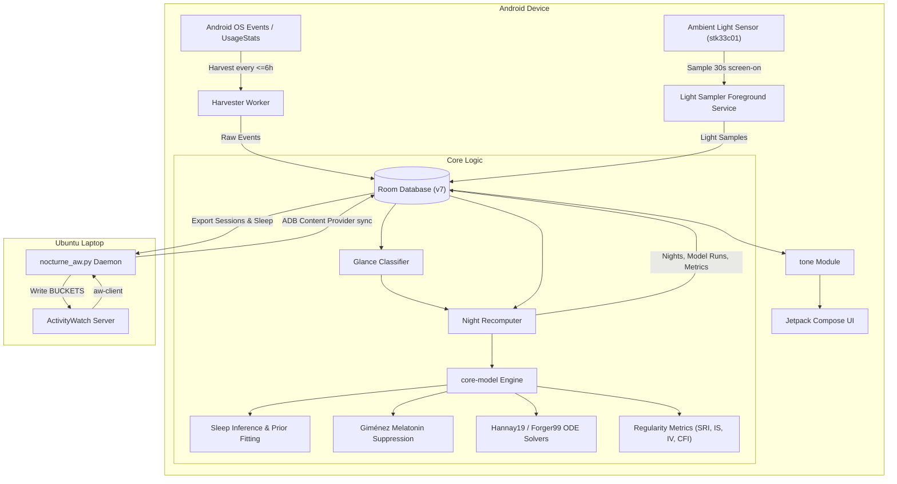
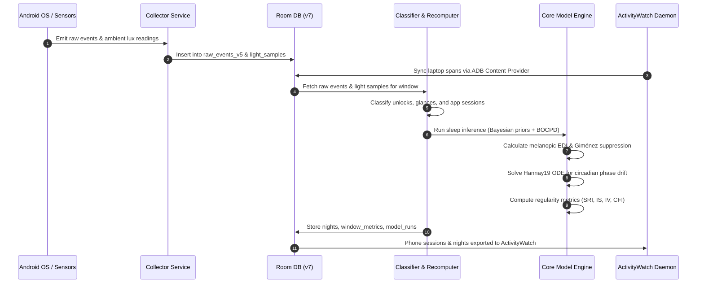
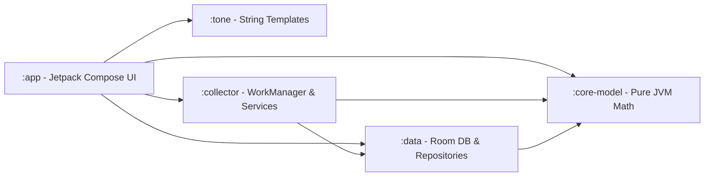
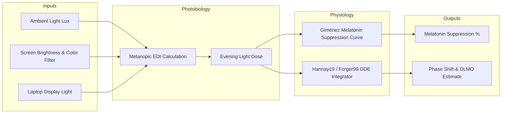
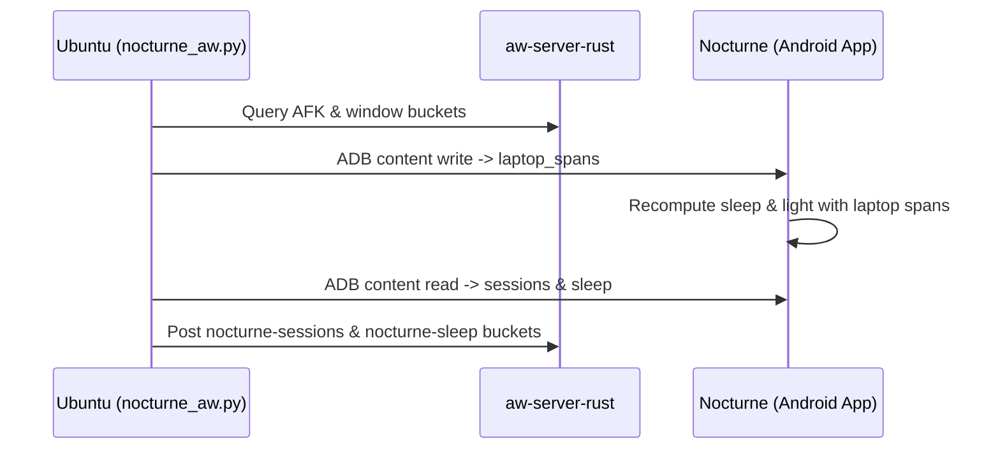

# Nocturne

Nocturne is a personal Android instrument for long-term tracking of night-time phone and laptop usage, inferring sleep patterns without wearables, and modeling the circadian impact of light exposure.

Unlike commercial screen-time trackers or Digital Wellbeing, Nocturne persists high-resolution event data indefinitely, classifies brief time-check glance unlocks, integrates published physiological models (Giménez melatonin suppression, Hannay19 and Forger99 ODE circadian phase estimators), and incorporates laptop activity via ActivityWatch.

---

## Key Pillars

1. **Indefinite Local Retention**: OS `UsageStatsManager` discards granular event logs after ~7 days. Nocturne continuously harvests raw Android events into an append-only SQLite database stored locally forever.
2. **Glance-Level Resolution**: Distinguishes between full interactive sessions, keyguard unlocks, and momentary screen wakes (e.g., checking the time for 4 seconds).
3. **Physiological Circadian & Sleep Modeling**:
   - **Light & Melatonin**: Computes melanopic Equivalent Daylight Illuminance (EDI) from ambient sensor readings and screen luminance, applying the Giménez (2014) non-linear dose-response curve to model melatonin suppression.
   - **Sleep Inference**: Passive sleep detection using screen state transitions, alarm interactions, and laptop activity via Bayesian priors and Bayesian Online Change Point Detection (BOCPD).
   - **Circadian Dynamics**: Integrates published 3-state ODE models (Hannay 2019, Forger 1999) to estimate circadian phase shifts ($\Delta \phi$) and Dim Light Melatonin Onset (DLMO).
   - **Regularity Metrics**: Calculates Sleep Regularity Index (SRI), Interdaily Stability (IS), Intradaily Variability (IV), Relative Amplitude (RA), and Circadian Function Index (CFI).
4. **Compassionate Copy & Objective Data**: Adheres to a strict tone policy—merciless, precise numbers paired with neutral, non-judgmental language. No adjectives blaming the user, no exclamation marks, and no emojis in insight strings.
5. **Cross-Platform Integration**: Integrates Linux laptop activity via a custom sync daemon connecting to `aw-server-rust` (ActivityWatch), unifying phone and laptop light/sleep dynamics.

---

## System Architecture



---

## Data & Processing Pipeline



---

## Module Overview

The codebase is organized as a multi-module Kotlin project with strict architectural boundaries:



### Module Responsibilities

- **`:core-model`**: Pure Kotlin JVM module with **zero Android dependencies**. Contains all numerical math, ODE differential equation solvers (Hannay 2019, Forger 1999), light dose calculations, Giménez melatonin suppression model, sleep inference logic, Bayesian priors, and actigraphy regularity algorithms. Validated against Python reference oracles (`Arcascope/circadian`, `nparACT`).
- **`:tone`**: Centralized string formatting and copy generator. Enforces non-judgmental, compassionate copy and strict formatting rules (no emojis, no exclamation marks).
- **`:data`**: Room Database implementation (currently Schema v7), entities, DAOs, schema migrations, CSV/Zip export engine, and ADB ContentProvider interface (`LaptopContentProvider`).
- **`:collector`**: Android background harvesting framework (`Harvester` WorkManager job), `LightSamplerService` (foreground service with `specialUse` type sampling light while screen is interactive), boot/timezone receivers.
- **`:app`**: Jetpack Compose UI layer featuring four main tabs:
  - **Tonight**: Real-time evening light dose, eye lux, glance counter, modelled melatonin suppression, and countdown to personal evening window.
  - **Focus**: Exact-alarm timer, phone-down gap cards, unlock counters, and reflection prompts.
  - **Regularity (Patterns)**: SRI score, onset/wake distribution charts, IS/IV actigraphy metrics, and weekly history.
  - **Settings**: System status, sensor diagnostics, display profiles, ADB debug tools, data export/import.
- **`tools/activitywatch`**: Python daemons and CLI tools running on Ubuntu Linux for bi-directional synchronization with ActivityWatch.
- **`tools/circadian` & `tools/bocpd`**: Python reference scripts used as test oracles for cross-validating Kotlin ODE solvers and change point algorithms.

---

## Circadian & Physiological Models



### 1. Melanopic Light Dose & Suppression
- **Eye Illuminance Model**: Combines ambient room lux from `Sensor.TYPE_LIGHT` with screen luminance calculated from current display brightness settings and dark mode / warm display filter states.
- **Giménez Dose-Response Model**: Applies non-linear saturation curves to model light-induced melatonin suppression during the evening window ($t = \text{Sleep Onset} - 3\text{h}$).

### 2. Sleep Inference Engine
- Uses passive phone interactions (last screen-off, alarm dismissions, keyguard events) merged with laptop activity.
- Applies Bayesian priors (Student-t distributions over habitual onset/wake) combined with a prior for sleepless nights.
- Employs Bayesian Online Change Point Detection (BOCPD) to detect sleep boundary shifts without manual annotations.

### 3. Circadian Phase Dynamics (ODE Solvers)
- Implements 4th-order Runge-Kutta (RK4) integration of the 3-state **Hannay 2019** and **Forger 1999** differential equation models.
- Predicts individual Dim Light Melatonin Onset (DLMO) and phase shift ($\Delta \phi$) trajectory under arbitrary light schedules.

---

## ActivityWatch Linux Integration

The `tools/activitywatch` subsystem connects Nocturne with `aw-server-rust`:

- **Laptop -> Phone**: Reads active display spans and AFK status from ActivityWatch, writing them to Nocturne's Room database via `adb shell content write`. Laptop light minutes directly feed sleep inference and light dose models.
- **Phone -> Laptop**: Reads classified phone sessions and inferred sleep intervals from Nocturne via `adb shell content read` and pushes them as custom buckets (`nocturne-sessions_<device>`, `nocturne-sleep_<device>`) into ActivityWatch.



---

## Database Schema Evolution

Nocturne maintains a Room database schema progression with zero-data-loss migrations:

| Schema Version | Key Changes |
|---|---|
| **v1** | Initial raw events (`raw_events_v4`), classified sessions, basic night records. |
| **v2** | Added `nights` table with sleep inference onset/wake, user labels, and confidence scoring. |
| **v3** | Added `light_samples` table for ambient sensor readings and screen brightness tracking. |
| **v4** | Added `window_metrics` and `model_runs` tables for tracking actigraphy regularity metrics over 7/14/28-night windows. |
| **v5** | Interned package names (`raw_events_v5`) for reduced storage footprint. |
| **v6** | Added `reflections` table for micro-EMA gap cards and focus timer records; dropped obsolete `raw_events_v4`. |
| **v7** | Added `laptop_spans`, `laptop_hosts`, and `nights.lightLaptopMinutes` for ActivityWatch cross-device sync. |

---

## Build & Development Setup

### Prerequisites
- **JDK**: Version 17
- **Android SDK**: Platform 37.2 (Build Tools 36+, `targetSdk` 36, Compose BOM 2026.09)
- **Gradle**: 9.6.0 (via wrapper)
- **Kotlin**: 2.4.20 (via AGP 9.4.0)

### Running Unit & Oracle Tests
Execute all JVM unit tests across modules:
```bash
./gradlew :core-model:test :tone:test :data:testDebugUnitTest :collector:testDebugUnitTest
```

### Installing on Device
Connect Android device via USB with ADB enabled and run:
```bash
./gradlew :app:installDebug
```

### ActivityWatch Daemon (Linux)
Install Python dependencies and run the sync daemon:
```bash
python3 tools/activitywatch/nocturne_aw.py sync
```

---

## License

Personal instrument software. All rights reserved.
